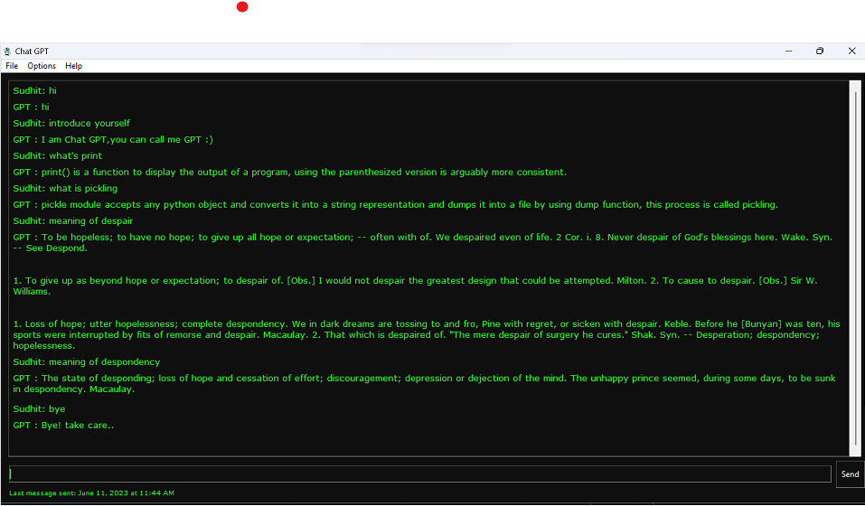

When you click the file option in the top left corner of the app, a dropdown menu with the options to clear the chat and exit the program appears. We can alter the interface's colors and font by clicking the "options" label next to the file option. A help option that specifies the program's creator is located next to the "options" label, and the "about" label describes how to use the app. When we begin speaking with the bot, the text that reads "No messages sent" at the bottom left changes to "last message sent at (date and time)".After entering the question in the text box and clicking the send button at the bottom right, the message is sent to the chatbot and gives the necessary output.The chatbot also uses a microphone to read the output.

Screenshot of the chatbot with hacker theme
